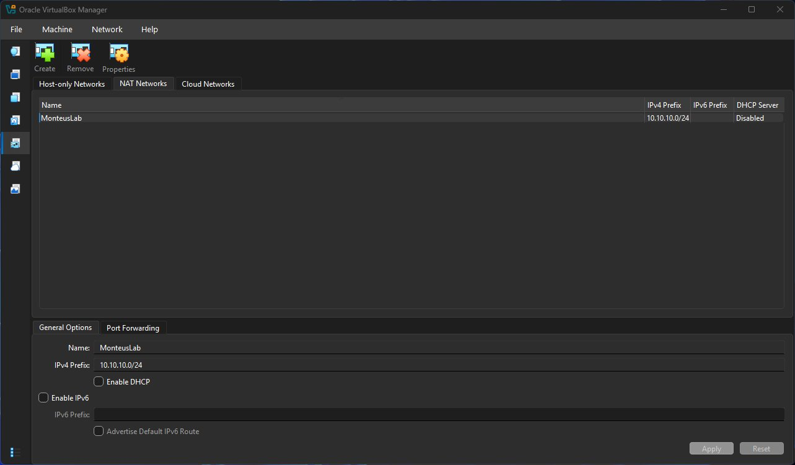
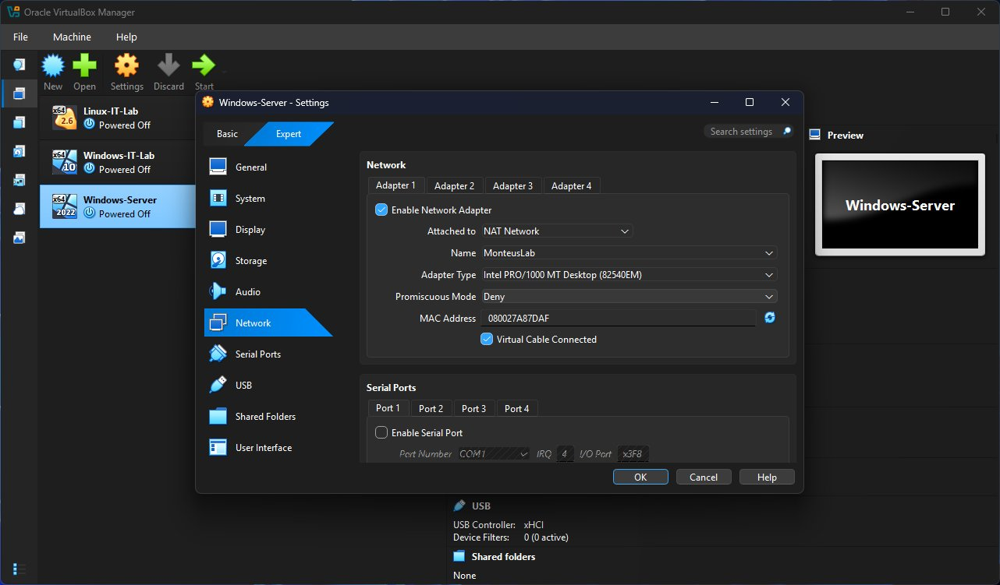
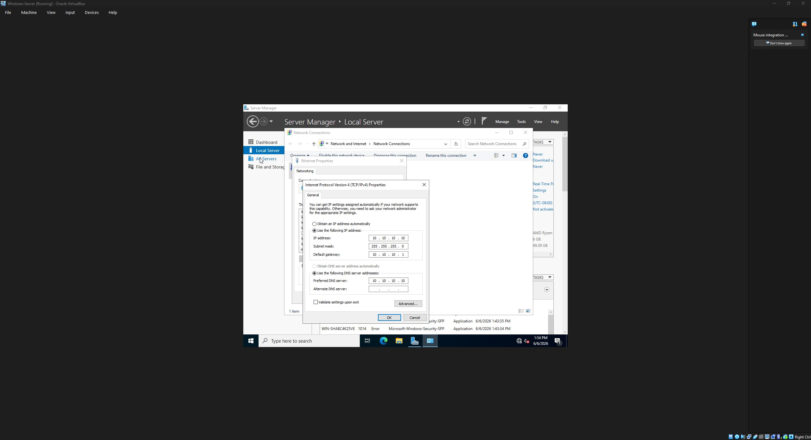
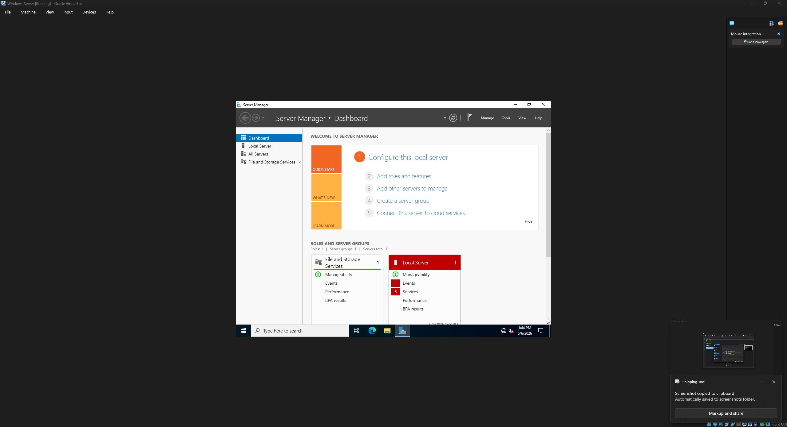
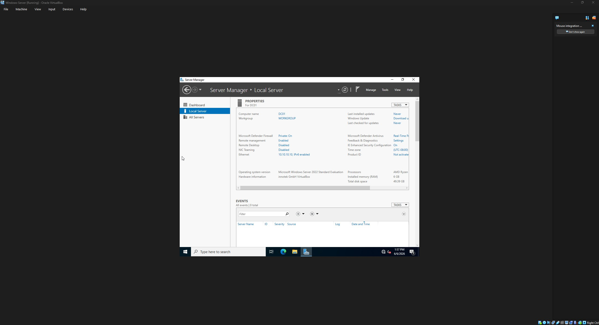
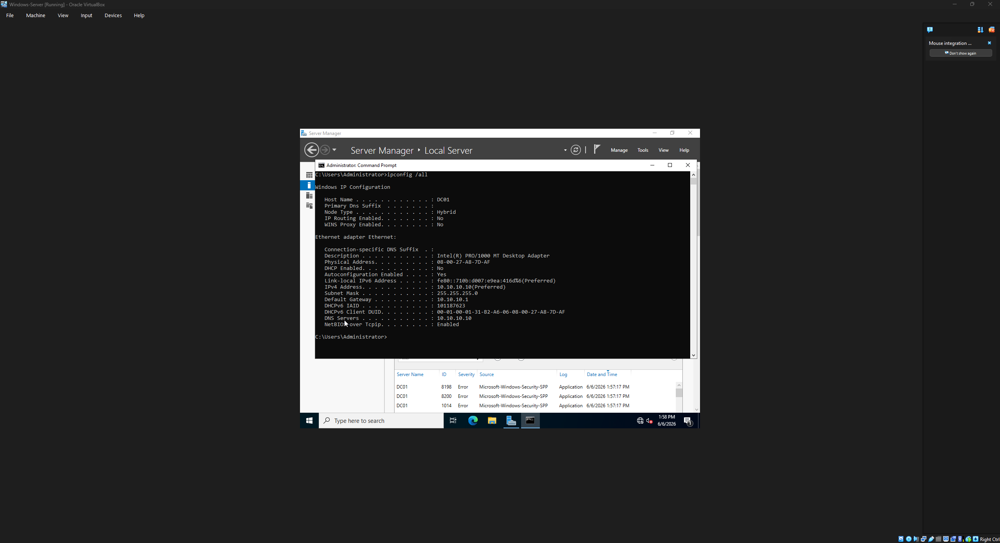

# Project 1 — Network Foundation & Windows Server Preparation

**Objective:** Build the isolated network layer the entire lab depends on, and prepare the Windows Server VM (DC01) so it's ready to be promoted to a domain controller in Project 2.

**Outcome:** A single-homed Windows Server 2022 VM on an isolated `/24`, with a static identity, renamed host, and a validated network — staged for AD promotion.

---

## Why Project 1 is the foundation

Everything in an AD environment rests on name resolution and a stable network. If the network layer is built carelessly — wrong VirtualBox mode, DHCP conflicts, a multi-homed DC — the failures don't show up here. They surface two or three projects later as broken replication or flaky DNS, and they're hard to trace back. So Project 1 is built slowly and deliberately, and every choice is recorded.

This project came down to **four design decisions**, each with a defendable reason.

---

## Decision 1 — VirtualBox NAT Network (not Bridged, not NAT)

VirtualBox offers several networking modes. The choice matters:

- **Bridged** would put the VMs directly on my real home LAN. Once DHCP is stood up on DC01 (Project 4), the DC would start leasing addresses to devices on my home network and fight my router — two DHCP servers in one broadcast domain causes outages. Rejected.
- **Plain NAT** isolates each VM so they can't talk to *each other*. AD requires the machines on one segment. Rejected.
- **NAT Network** gives all three things the lab needs: VMs can talk to each other, they can reach the internet for updates, and the whole segment is walled off from the home network.

**Chosen:** NAT Network `MonteusLab`, `10.10.10.0/24`, gateway `10.10.10.1`.


*NAT Network properties: CIDR `10.10.10.0/24`, DHCP **disabled**, IPv6 disabled.*

## Decision 2 — VirtualBox's built-in DHCP turned OFF

The NAT Network was created with **DHCP disabled**. VirtualBox has its own DHCP server, and if left on it would compete with the DHCP role DC01 takes on in Project 4. The domain controller must be the **sole DHCP authority** on this segment — two servers leasing into the same scope is exactly the conflict being avoided. Turning it off here is a deliberate decision, not an oversight.

> Captured in the NAT Network image above — DHCP shown as Disabled.

## Decision 3 — DC01 is single-homed (one NIC)

Each VM was attached to the NAT Network with a **single network adapter** (Adapter 1 only). A domain controller with multiple active NICs is a well-known anti-pattern: DNS registers all interfaces, which causes resolution and replication problems. Keeping DC01 single-homed avoids this entirely.


*DC01 VM network settings: Adapter 1 → NAT Network → `MonteusLab`, single NIC.*

## Decision 4 — Static IP with DNS pointed at itself

DC01 was given a static IPv4 configuration. A DC cannot use DHCP for its own address — every client will point to the DC's IP for DNS, so that address can never change.

| Setting | Value | Reason |
|---------|-------|--------|
| IP address | `10.10.10.10` | Fixed identity for the DC |
| Subnet mask | `255.255.255.0` | /24 segment |
| Default gateway | `10.10.10.1` | NAT Network gateway |
| Preferred DNS | `10.10.10.10` | **Itself** — see below |

**The DNS choice is the key one.** The DC points to *itself* for DNS because in Project 2 it *becomes* the DNS server for the whole domain. Pointing a DC at a public resolver (e.g. 8.8.8.8) or another box for primary DNS breaks AD replication and is a classic misconfiguration. The DC resolves through itself; the loopback-style self-reference is correct by design.


*IPv4 properties showing the static config above — note Preferred DNS pointed at itself (10.10.10.10).*

---

## Host preparation steps

1. **Windows Server 2022 (Desktop Experience)** installed clean. Desktop Experience over Server Core for the learning phase — full GUI.


*Clean Windows Server 2022 Standard (Desktop Experience) install at first boot.*

2. **Hostname set to `DC01` before promotion.** This is done *now*, while the machine is a plain server, because the hostname is baked into AD, DNS, and the domain's SRV records during promotion. Renaming a DC after the fact is risky and involves hand-editing DNS — so it's locked in first.
3. **Time zone / clock corrected.** Set to Eastern and the actual time set manually (internet time sync can't be relied on yet — the DC's DNS points to itself with nothing answering until Project 2). Kerberos tolerates 5 minutes of skew *between domain members*, so the real requirement is consistency across VMs, which the clients will get from the DC after domain join.


*Local Server confirming `Computer name: DC01`, `Ethernet: 10.10.10.10`, Workgroup WORKGROUP (correct — the DC creates the domain in Project 2; clients join in Project 6).*

---

## Validation

After the rename and reboot, the network was validated from within DC01:

```
hostname        → DC01
ipconfig /all   → IPv4 10.10.10.10 / 255.255.255.0, GW 10.10.10.1, DNS 10.10.10.10
ping 10.10.10.1 → 4 packets sent, 4 received (segment alive)
```


*`ipconfig /all` on DC01. Every Project 1 design decision is visible in one frame: Host Name `DC01`, DHCP Enabled `No` (static), IPv4 `10.10.10.10 (Preferred)`, Gateway `10.10.10.1`, DNS Servers `10.10.10.10` (self), and a link-local IPv6 address confirming IPv6 remains bound at the OS level. The Primary DNS Suffix is blank — correct for the pre-promotion state; it will populate to `monteus.lab` after Project 2.*

---

## A gotcha I deliberately avoided: IPv6

Many tutorials say to uncheck IPv6 on the DC's NIC "to keep things clean." **That is wrong, and it's a known interview trap.** Microsoft explicitly advises *against* disabling IPv6 on domain controllers — parts of AD assume it's present, and disabling it can cause unexpected breakage.

What I did instead: scoped IPv6 off at the **NAT Network level** (no routable v6 traffic on the segment) while leaving the **OS-level protocol bound** on DC01. That split — hypervisor layer vs. OS layer — is the correct approach.

---

## Ops note

A VirtualBox snapshot (`Pre-AD-clean`) was taken before moving to Project 2. AD promotion is the first hard-to-reverse step; snapshotting before major changes is standard practice and lets me roll back to this validated state instantly if Project 2 goes sideways.

---

## State at end of Project 1

✅ Isolated NAT Network, DHCP disabled
✅ DC01 single-homed, static IP, DNS → self
✅ Hostname `DC01`, clock correct
✅ Network validated, snapshot taken

**Next:** [Project 2 — AD DS + integrated DNS](../Project-2-AD-DS/README.md) *(in progress)*
