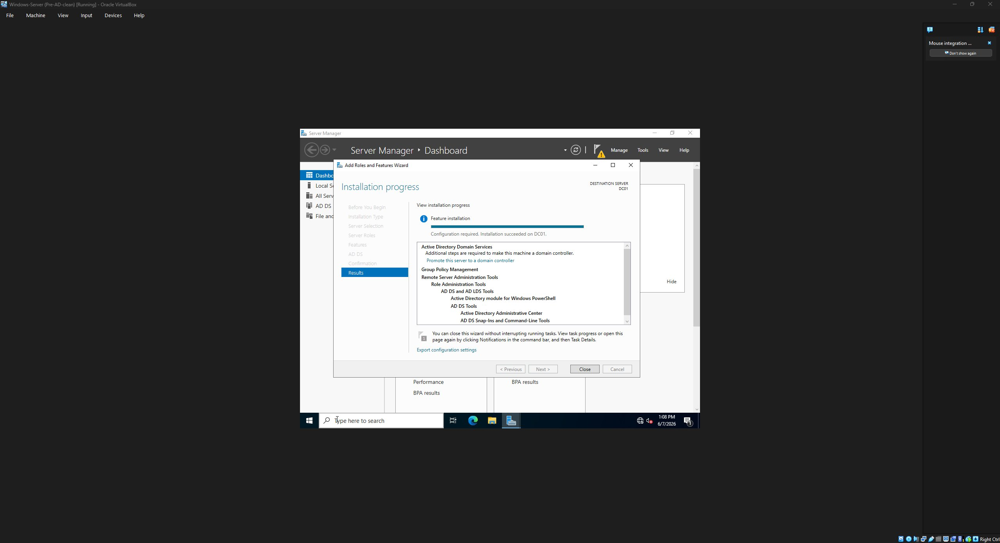
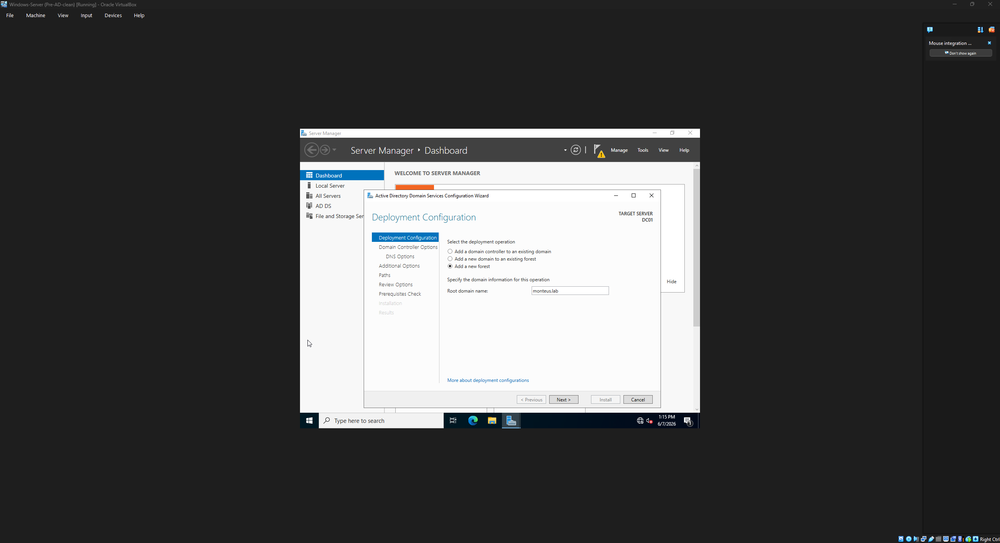
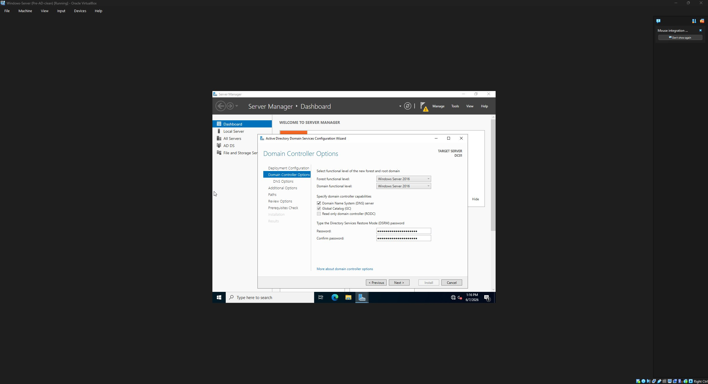
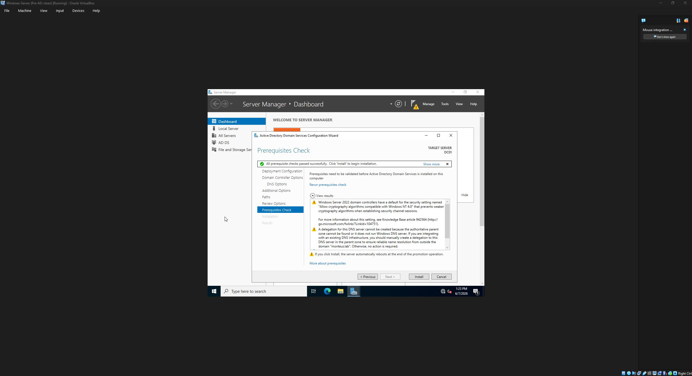
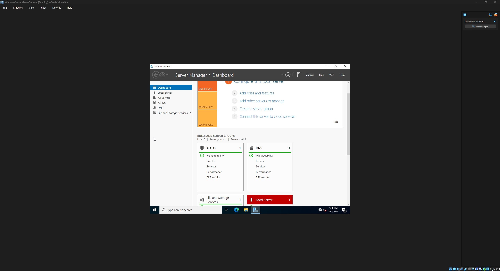
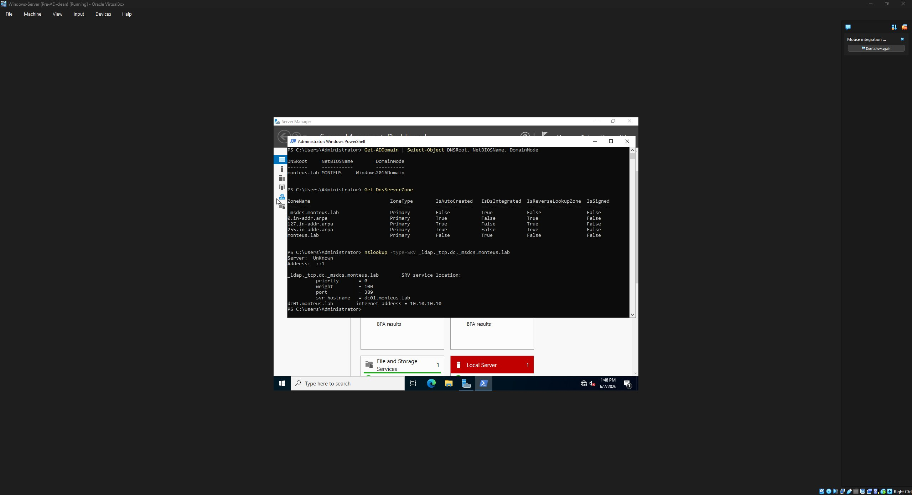
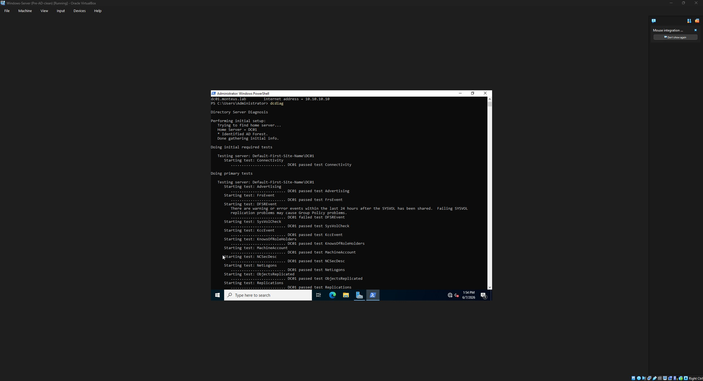
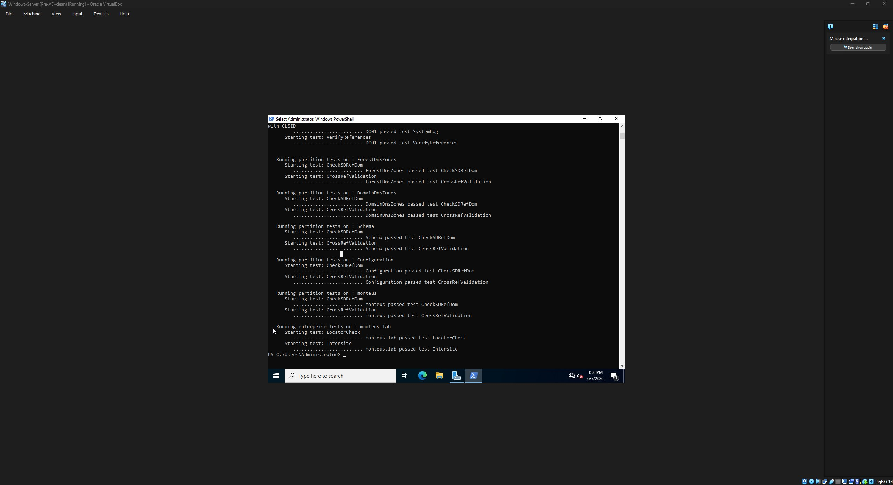
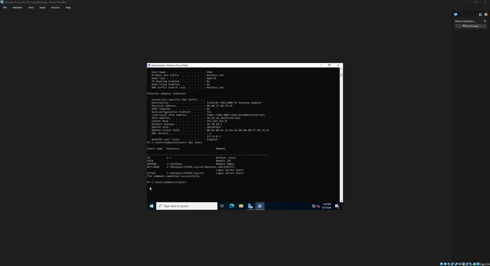
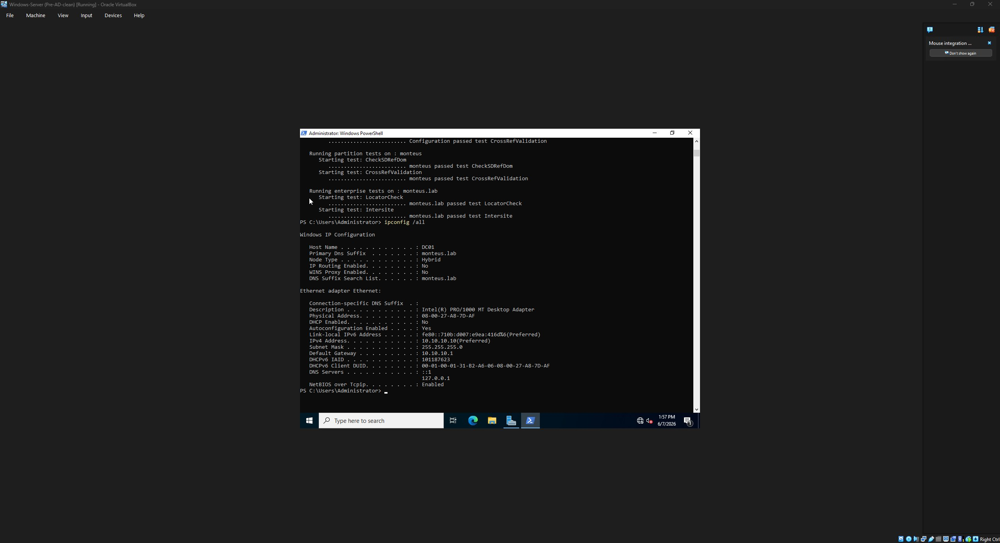

# Project 2 — Active Directory Domain Services & Integrated DNS

**Objective:** Promote DC01 (prepared in Project 1) into the first domain controller of a new forest, with DNS integrated into Active Directory, then *verify* the promotion at the level that actually matters.

**Outcome:** A live, validated domain — `monteus.lab` / NetBIOS `MONTEUS` — with AD-integrated DNS, working DC-locator SRV records, and a full health check including one diagnosed (benign) failure.

---

## Install ≠ promotion: the distinction that frames this project

Standing up a domain controller is two separate operations that people often blur into one:

1. **Installing the AD DS role** puts the binaries on the machine. The server is still a plain standalone box — the AD software just sits there, dormant.
2. **Promotion** is what actually creates (or joins) a domain, builds the directory database, and — in this build — installs and integrates DNS.

Keeping these distinct matters: after step 1 nothing about the server's identity has changed, and DNS doesn't exist yet. Both appear during step 2.

---

## Phase 1 — Install the AD DS role

Server Manager → Manage → Add Roles and Features → Role-based → selected DC01 → checked **Active Directory Domain Services** (accepting the prompt to add the management tools: RSAT AD DS snap-ins, AD PowerShell module, Group Policy Management).


*Role install complete. Note "Configuration required. Installation succeeded on DC01" and the "Promote this server to a domain controller" link — the binaries are installed, but DC01 is **not** yet a domain controller.*

No reboot is needed after the role install. A yellow warning flag appears in Server Manager, which is the entry point to promotion.

---

## Phase 2 — Promotion

### Deployment configuration: new forest


*Selected **Add a new forest** with root domain `monteus.lab`. The other two options (add a DC to an existing domain / add a domain to an existing forest) both assume AD already exists somewhere — this is the very first DC, so we create the forest from nothing. `monteus.lab` becomes both the forest root and the first domain.*

### Domain controller options


*Forest and domain functional levels left at the default (Windows Server 2016, the highest this OS offers). **DNS server checked** — this is where DNS gets installed and integrated. **Global Catalog** is mandatory for the first DC. A DSRM (Directory Services Restore Mode) password was set — this is a separate recovery credential used to repair a broken directory database, not the domain admin password.*

**On functional levels:** they gate which AD features are available and set the minimum OS for future DCs. For a single new forest the default is correct. They can be raised later but not easily lowered.

### Prerequisite check — passing *with expected warnings*


*Green banner: all prerequisite checks passed. Two yellow warnings appeared, both expected and benign:*

- **NT 4.0 cryptography:** Server 2022 DCs block weak legacy crypto by default. This is a security default being announced, not a problem.
- **DNS delegation:** `monteus.lab` has no parent zone in public DNS, so there is nothing to delegate from. The wizard itself states "no action is required."

The distinction between a *warning* and a *blocking error* (red X) matters here — only a red X stops the install. Reading the warnings and understanding why each was expected, rather than aborting at the sight of a yellow triangle, is the point.

Promotion was run; the server auto-rebooted to complete it.

### After promotion


*Post-reboot dashboard: Roles count is now 3 (was 1), with **AD DS** and **DNS** both present and green. DNS appearing here is the proof it was installed and integrated during promotion. (The Local Server tile shows red immediately after promotion — transient, caused by remote-management/WinRM not being fully configured; not a failure of AD itself.)*

---

## Validation — proving it worked

A promotion that "completes" isn't the same as a promotion that *works*. Four checks.

### 1 + 2. Domain identity, DNS zones, and the SRV records



```powershell
Get-ADDomain | Select-Object DNSRoot, NetBIOSName, DomainMode
# → monteus.lab | MONTEUS | Windows2016Domain

Get-DnsServerZone
# → _msdcs.monteus.lab (IsDsIntegrated: True), monteus.lab (IsDsIntegrated: True), + reverse zones

nslookup -type=SRV _ldap._tcp.dc._msdcs.monteus.lab
# → svr hostname = dc01.monteus.lab, port 389, internet address 10.10.10.10
```

The SRV lookup is the single most important validation in this project. A client asking "who provides LDAP for this domain?" gets back `dc01.monteus.lab` on port 389 (LDAP) at `10.10.10.10`. **This is the exact mechanism every future client uses to find the domain** — clients don't get handed a DC's IP, they query these SRV records. Proving the record resolves proves the domain is discoverable.

**`IsDsIntegrated: True`** is worth calling out: the DNS zones live inside the AD database (replicated, fault-tolerant) rather than as flat text files on a single server. That's the integrated-DNS payoff and the modern default.

*(Minor note: nslookup reported `Server: UnKnown / Address: ::1` — it reached DNS over the IPv6 loopback and couldn't reverse-resolve its own name to a label. Cosmetic; the query still returned the correct answer.)*

### 3. Health check — dcdiag





dcdiag ran ~25 tests. **All structural tests passed:** Connectivity, Advertising, Services, NetLogons, Replications, RidManager, KnowsOfRoleHolders, MachineAccount, SysVolCheck, all partition tests (ForestDnsZones, DomainDnsZones, Schema, Configuration), and the enterprise tests **LocatorCheck** and **Intersite** (which confirm the DC-locator SRV mechanism works at forest scope).

**One test failed — `DFSREvent` — and diagnosing it is the most useful part of this project.**

`DFSREvent` scans the DFS Replication event log for warnings/errors in the **last 24 hours** related to SYSVOL replication. DC01 was promoted minutes earlier, so the initial SYSVOL setup events were still inside that 24-hour window and tripped the test. The giveaway: **`SysVolCheck` passed** right beside it — SYSVOL itself is healthy; only the recent-event scan flagged the brand-new setup activity. There is also no replication partner (single DC), so replication problems are structurally impossible.

In a multi-DC production environment a DFSREvent failure would warrant investigation (it can mean GPOs aren't propagating). On a fresh single-DC lab it is promotion noise that clears once the 24-hour window passes.

**Verification that it's benign:**



```
net share
# → SYSVOL   C:\Windows\SYSVOL\sysvol                       Logon server share
# → NETLOGON C:\Windows\SYSVOL\sysvol\monteus.lab\SCRIPTS   Logon server share
```

Both critical shares exist and are published — confirming SYSVOL is functional and the DFSREvent flag was cosmetic.

**Benign dcdiag warnings worth understanding:**
- **Time source:** DC01 holds the PDC Emulator role at the forest root, so it has no upstream domain time source ("...there is no machine above it in the domain hierarchy..."). Expected; in production you'd point the PDC emulator at an external NTP server.
- **External name resolution fails** (`time.windows.com`, etc.): DC01 points to itself for DNS with no forwarders configured, so it can't resolve internet names. Internal `monteus.lab` resolution works perfectly — which is all AD requires. Forwarders are optional and can be added later.
- **WinRM / SPN warnings:** remote management isn't fully configured — the likely cause of the red Local Server tile. Benign.
- **Write-cache / DCOM (Event 10016):** virtual-disk and well-known Windows noise. Ignore.

### 4. Self-registration



```
ipconfig /all
# Host Name: DC01
# Primary DNS Suffix: monteus.lab   ← was BLANK in Project 1
# DNS Servers: ::1 / 127.0.0.1
```

The **Primary DNS Suffix** is now `monteus.lab` (blank before promotion) — DC01 has registered itself into the domain it created. The DNS Servers entry changed from `10.10.10.10` to loopback (`::1` / `127.0.0.1`): once a box becomes its own DNS server, Windows points it at loopback. Same destination (itself), different notation — not a regression.

---

## State at end of Project 2

✅ AD DS role installed; DC01 promoted to first DC of forest `monteus.lab`
✅ Integrated DNS installed during promotion; `_msdcs` zone AD-integrated
✅ DC-locator SRV records resolve DC01 as LDAP server (port 389 → 10.10.10.10)
✅ dcdiag: all structural tests pass; lone DFSREvent failure diagnosed as benign promotion noise and confirmed via `net share`
✅ SYSVOL + NETLOGON published
✅ DC01 self-registered into the domain

**Next:** Project 3 — Organizational Unit structure + AD users and groups *(planned)*

---

### Reflection

The promotion clicks took minutes; the validation is where the learning lived. The DFSREvent failure is deliberately documented rather than hidden: a clean run proves you can follow a wizard, but correctly diagnosing *why* a test failed — and proving it benign rather than assuming it — is the actual skill. It also previews the fault-injection capstone in Project 7.
